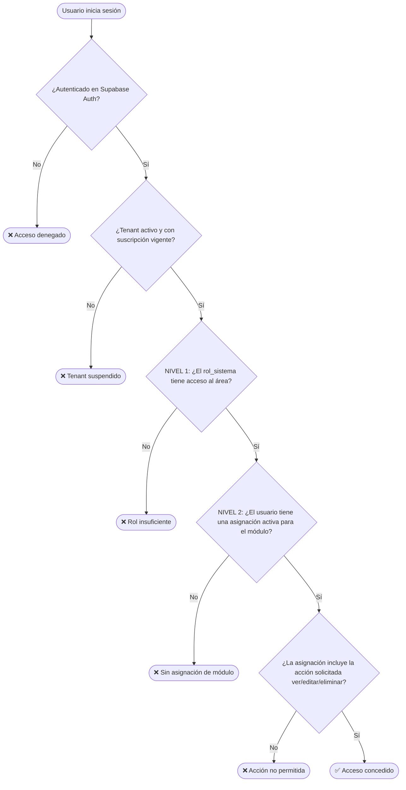

# Documentación del Sistema de Control de Acceso (ACL)

## Visión General

Este documento explica la arquitectura de control de acceso implementada en el sistema **SaaS Multi-Tenant de Gestión de Restaurantes**. El sistema utiliza dos niveles complementarios para garantizar tanto la seguridad global como la flexibilidad granular.

---

## 📐 Diagrama de Flujo de Acceso



---

## 🗂️ Tablas del Sistema de Permisos

### Tabla `roles_sistema` — Nivel 1: Macrofiltro Global

Define el **techo máximo de acceso** de un usuario. Es el primer filtro.

| Campo | Descripción |
| :--- | :--- |
| `nivel` | Enum: `superadmin`, `admin`, `supervisor`, `cocina`, `bar`, `mozo`, `general` |
| `tenant_id` | `NULL` = rol global del SaaS. Con valor = personalización del tenant |
| `es_sistema` | `TRUE` = no editable por el tenant. `FALSE` = personalizado por el admin |

**Jerarquía de niveles (mayor número = más privilegio):**

| Nivel | Orden | Puede acceder a |
| :--- | :---: | :--- |
| `superadmin` | 100 | Todo el sistema, todos los tenants |
| `admin` | 80 | Todo su propio tenant |
| `supervisor` | 60 | Operaciones + gestión + reportes básicos |
| `cocina` | 40 | Panel de cocina, pedidos activos |
| `bar` | 35 | Panel de bar, pedidos de bebidas |
| `mozo` | 30 | Sus mesas asignadas, menú QR |
| `general` | 10 | Acceso mínimo (lectura básica) |

---

### Tabla `modulos` — Catálogo de Funcionalidades

Cada módulo representa una **microapp de Flutter**. Define el `nivel_minimo_requerido` para que el módulo sea siquiera visible.

| Código | Nombre | Nivel Mínimo | Categoría |
| :--- | :--- | :--- | :--- |
| `MENU_QR` | Menú QR Cliente | `general` | cliente |
| `COCINA_KANBAN` | Panel de Cocina | `cocina` | operaciones |
| `BAR_KANBAN` | Panel de Bar | `bar` | operaciones |
| `COMEDOR_VISTA` | Vista de Comedor | `supervisor` | operaciones |
| `PEDIDOS_ACTIVOS` | Pedidos Activos | `cocina` | operaciones |
| `ADMIN_MENU` | Gestión de Menú | `admin` | gestion |
| `ADMIN_MESAS` | Gestión de Mesas | `admin` | gestion |
| `ADMIN_USUARIOS` | Gestión de Usuarios | `admin` | gestion |
| `ADMIN_RESERVAS` | Gestión de Reservas | `supervisor` | gestion |
| `ADMIN_STOCK` | Control de Stock | `supervisor` | gestion |
| `REPORTES_VENTAS` | Reportes de Ventas | `admin` | reportes |
| `REPORTES_HISTORIAL` | Historial Completo | `supervisor` | reportes |
| `CONFIG_NEGOCIO` | Configuración del Negocio | `admin` | configuracion |
| `SAAS_BILLING` | Suscripción (SaaS) | `superadmin` | saas |

---

### Tabla `permisos_modulo` — Nivel 2: Acciones Granulares

Define **qué se puede hacer** dentro de cada módulo. Convención de nombre: `MODULO_ACCION`.

**Acciones disponibles:** `ver`, `crear`, `editar`, `eliminar`, `exportar`, `aprobar`, `configurar`

**Ejemplos de permisos:**

| Código Permiso | Acción | Módulo |
| :--- | :--- | :--- |
| `MENU_VER` | `ver` | ADMIN_MENU |
| `MENU_CREAR` | `crear` | ADMIN_MENU |
| `MENU_EDITAR` | `editar` | ADMIN_MENU |
| `MENU_ELIMINAR` | `eliminar` | ADMIN_MENU |
| `REPORTES_VER` | `ver` | REPORTES_VENTAS |
| `REPORTES_EXPORTAR` | `exportar` | REPORTES_VENTAS |
| `RESERVAS_CONFIRMAR` | `aprobar` | ADMIN_RESERVAS |
| `PEDIDOS_CAMBIAR_ESTADO` | `editar` | PEDIDOS_ACTIVOS |

---

### Tabla `asignaciones` — La Intersección Central

Es la tabla que **une usuarios con permisos específicos** dentro de un tenant. El admin del restaurante la gestiona desde el panel de Gestión de Usuarios.

**Casos de uso reales:**

**Caso 1: Supervisor con acceso a reportes pero sin eliminar historial**
```sql
-- Asignar permiso de VER reportes al supervisor Juan
INSERT INTO asignaciones (tenant_id, usuario_id, permiso_modulo_id)
SELECT 'tenant-uuid', 'juan-uuid', id FROM permisos_modulo WHERE codigo = 'REPORTES_VER';

-- NO se le asigna HISTORIAL_ELIMINAR → no puede borrar registros
```

**Caso 2: Permiso temporal (ej: cocinero que cubre el turno de supervisor)**
```sql
INSERT INTO asignaciones (tenant_id, usuario_id, permiso_modulo_id, fecha_expiracion, notas)
SELECT 
  'tenant-uuid', 
  'cocinero-uuid', 
  id, 
  NOW() + INTERVAL '8 hours',  -- Solo por el turno
  'Cobertura turno noche 04/06/2026'
FROM permisos_modulo 
WHERE codigo IN ('COMEDOR_VISTA', 'ADMIN_RESERVAS');
```

**Caso 3: Mozo que puede ver el menú pero no editarlo**
```sql
INSERT INTO asignaciones (tenant_id, usuario_id, permiso_modulo_id)
SELECT 'tenant-uuid', 'mozo-uuid', id FROM permisos_modulo WHERE codigo = 'MENU_VER';
-- Sin 'MENU_CREAR', 'MENU_EDITAR' ni 'MENU_ELIMINAR'
```

---

## 🔐 Flujo del JWT de Supabase

Al hacer login, el **Custom Access Token Hook** (función PostgreSQL registrada en Supabase) enriquece el JWT con:

```json
{
  "sub": "user-auth-uuid",
  "email": "juan@restaurant.com",
  "tenant_id": "tenant-uuid-aqui",
  "nivel_acceso": "supervisor",
  "user_name": "Juan García",
  "tenant_activo": true,
  "exp": 1234567890
}
```

Flutter lee estos claims del JWT usando `supabase.auth.currentSession?.accessToken` y los usa para:
1. Mostrar/ocultar módulos en el menú lateral
2. Deshabilitar botones de acciones no permitidas
3. Las políticas RLS los validan automáticamente en cada query a Supabase

---

## 📱 Implementación en Flutter

### Función de carga al iniciar sesión

```dart
// En core_auth/repositories/auth_repository.dart

Future<AccesoUsuarioModel> getAccesoCompleto() async {
  final response = await supabase
    .rpc('get_acceso_usuario', params: {
      'p_usuario_id': supabase.auth.currentUser!.id,
    });
  
  return AccesoUsuarioModel.fromJson(response);
}
```

### Verificar permiso en la UI

```dart
// En cualquier widget de la app

// Verificar si el usuario tiene el permiso 'MENU_EDITAR'
final tienePermiso = acceso.permisosActivos.contains('MENU_EDITAR');

ElevatedButton(
  onPressed: tienePermiso ? () => _editarProducto() : null,
  child: Text('Editar'),
)
```

### Guardar en Riverpod al iniciar sesión

```dart
// En core_auth/providers/acceso_provider.dart

final accesoProvider = StateNotifierProvider<AccesoNotifier, AccesoState>((ref) {
  return AccesoNotifier(ref.read(authRepositoryProvider));
});

class AccesoNotifier extends StateNotifier<AccesoState> {
  // Al hacer login, llamar a get_acceso_usuario() y guardar en state
  // Flutter construye el menú lateral dinámicamente a partir del state
}
```

---

## 🛡️ Resumen de Capas de Seguridad

| Capa | Tecnología | Responsabilidad |
| :--- | :--- | :--- |
| **Auth** | Supabase Auth | Login/logout, tokens JWT, expiración |
| **JWT Claims** | PostgreSQL Hook | Tenant ID y nivel de rol en el token |
| **RLS Tenant** | PostgreSQL RLS | Ningún usuario ve datos de otro tenant |
| **RLS Rol** | PostgreSQL RLS | Solo roles permitidos acceden a ciertas tablas |
| **Asignaciones** | Función `get_acceso_usuario()` | Permisos granulares por módulo y acción |
| **UI Flutter** | Riverpod + lógica condicional | Ocultar/deshabilitar UI según permisos |
