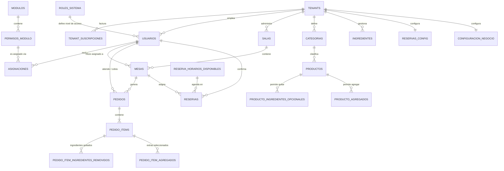
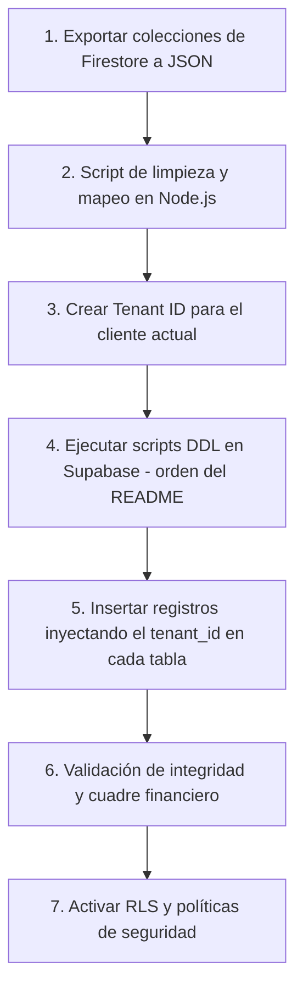

# Guía de Migración — De Firebase a SaaS Multi-Tenant (Documento de Estrategia)

> **Tipo de documento:** Estrategia y toma de decisiones  
> **Alcance:** Define el POR QUÉ y el CÓMO de la migración. Los scripts ejecutables se encuentran en `BASE_DE_DATOS/SCHEMAS/`.

---

## 📊 1. Análisis del Sistema Actual vs. Sistema Propuesto

### 1.1 Comparativa Tecnológica

| Característica | Firebase/Firestore (Actual) | Supabase/PostgreSQL (Propuesto) | Ventaja de la Migración |
| :--- | :--- | :--- | :--- |
| **Arquitectura** | Single-tenant (app aislada por cliente) | Multi-tenant SaaS con RLS | Un solo backend sirve a N restaurantes. Despliegue y mantenimiento centralizado. |
| **Estructura de Datos** | Documentos NoSQL semi-estructurados | Tablas relacionales con esquema estricto | Mayor consistencia y prevención de inconsistencias. |
| **Relaciones** | Embebidas (arrays/maps) o referencias laxas | `FOREIGN KEY` con restricciones de integridad | Integridad referencial automática. Cero registros huérfanos. |
| **Transacciones** | Limitadas (lotes de escritura) | ACID robustas | Procesamiento concurrente de pedidos y pagos sin colisiones. |
| **Historial** | Colecciones separadas (`cobrados`, `historial`) | Una sola tabla con estados y ciclo de vida | Reportes financieros instantáneos via SQL (`GROUP BY`, `SUM`). |
| **Control de Acceso** | Reglas de Firestore (limitadas) | RLS + Sistema ACL de dos niveles | Permisos granulares por módulo, rol y acción. |
| **Búsquedas y Reportes** | Sin JOINs, agregaciones costosas en el cliente | Consultas SQL con `JOIN`, índices parciales y vistas | Analytics potente del lado del servidor, sin carga en Flutter. |
| **Escalabilidad** | Costos escalan con lecturas/escrituras | Costo predecible basado en instancia | Sostenible para modelo SaaS con múltiples clientes. |

---

## 🏗️ 2. Decisiones de Arquitectura de Base de Datos

### 2.1 Estrategia Multi-Tenant: Esquema Único con RLS

Se adoptó el enfoque de **esquema compartido con aislamiento lógico por `tenant_id`** en lugar de esquemas separados por cliente.

**Justificación:**
- ✅ Más simple de mantener (una sola base de código SQL).
- ✅ Migraciones de esquema se aplican a todos los tenants a la vez.
- ✅ Supabase RLS garantiza el aislamiento sin código adicional en Flutter.
- ✅ Escalable a cientos de tenants sin overhead de gestión.

**Alternativas descartadas:**
- ❌ *Esquemas separados por tenant*: Mayor complejidad operacional, migraciones costosas.
- ❌ *Bases de datos separadas por tenant*: Inviable para un SaaS con muchos clientes pequeños.

### 2.2 Sistema de Control de Acceso (ACL) de Dos Niveles

Se diseñó un sistema híbrido que combina **roles de sistema** (macrofiltro) con **permisos granulares por módulo** (microfiltro):

```
Nivel 1: roles_sistema    → TECHO de acceso (ej: mozo NUNCA ve reportes)
Nivel 2: modulos +        → PISO granular (ej: admin puede ver reportes
         permisos_modulo              pero NO puede exportarlos)
         + asignaciones
```

**Ventaja sobre el enfoque anterior (solo roles):**
Un admin puede crear roles personalizados para su restaurante y asignar permisos específicos a cada empleado, adaptándose a la estructura real del negocio sin necesidad de crear nuevos roles de sistema.

### 2.3 Normalización Aplicada (Firestore → PostgreSQL)

| Problema en Firestore | Solución en PostgreSQL |
| :--- | :--- |
| Colecciones `productos` y `bebidas` separadas con 90% de campos iguales | Tabla única `productos` con columna `tipo` (`'comida'`, `'bebida'`) |
| Array `ingredientes_opcional` embebido en el documento de producto | Tabla `producto_ingredientes_opcionales` con FK |
| Array `agregados [{nombre, precio}]` embebido en producto | Tabla `producto_agregados` con FK |
| Array `items` embebido en cada pedido | Tabla `pedido_items` con relación maestro-detalle |
| Ciclo de vida en múltiples colecciones (`pedidos` → `cobrados` → `historial`) | Una sola tabla `pedidos` con campos de estado y auditoría |
| Configuración en documentos únicos fijos | Tablas de configuración con `tenant_id` como PK (relación 1:1 por tenant) |

---

## 🗺️ 3. Diagrama Entidad-Relación (Visión General)



---

## 📁 4. Referencia a Scripts de Base de Datos

Los scripts DDL ejecutables están organizados en `BASE_DE_DATOS/`. Ver el `README.md` de esa carpeta para el orden de ejecución.

| Script | Tablas que crea |
| :--- | :--- |
| `SCHEMAS/01_saas_core_schema.sql` | `tenants`, `tenant_suscripciones` |
| `SCHEMAS/02_roles_modulos_permisos_schema.sql` | `roles_sistema`, `modulos`, `permisos_modulo`, `asignaciones` |
| `SCHEMAS/03_operaciones_negocio_schema.sql` | `usuarios`, `salas`, `mesas`, `categorias`, `productos`, `pedidos` y sub-tablas |
| `SCHEMAS/04_reservas_configuracion_schema.sql` | `reservas`, `reservas_config`, `configuracion_negocio` |
| `RLS/01_rls_policies.sql` | Políticas de seguridad RLS |
| `BACKEND/01_funciones_backend.sql` | JWT Hook, funciones de analytics, triggers |

---

## 🚀 5. Plan de Migración de Datos (Firestore ➔ PostgreSQL)

La data del cliente original del proyecto "Menu QR" (actualmente en Firebase) pasará a ser el **Tenant #1** del nuevo sistema SaaS.

### Flujo de Migración



### 5.1 Orden de Inserción (Respeto de Foreign Keys)

Para evitar violaciones de integridad referencial, los datos deben insertarse en este orden estricto:

1. `tenants` ← Crear el restaurante como Tenant #1
2. `roles_sistema` ← Ya cargados por el script semilla
3. `usuarios` ← Empleados existentes, vinculados al tenant
4. `salas` ← Salones del restaurante
5. `mesas` ← Mesas de cada salón
6. `categorias` ← Categorías del menú
7. `productos` ← Productos y bebidas (tabla unificada)
8. `producto_ingredientes_opcionales` y `producto_agregados`
9. `ingredientes` ← Stock de materia prima
10. `reservas_config` ← Configuración de reservas del tenant
11. `reserva_horarios_disponibles`
12. `reservas` ← Reservas históricas
13. `pedidos` ← Migración de `pedidos` + `cobrados` + `historial` de Firestore
14. `pedido_items`
15. `pedido_item_ingredientes_removidos` y `pedido_item_agregados`
16. `configuracion_negocio` ← Configuración de geofencing y negocio
17. `asignaciones` ← Permisos de cada empleado

### 5.2 Pseudocódigo del Script de Migración (Node.js)

```javascript
// migration/migrate_firestore_to_supabase.js

const TENANT_ID = 'uuid-generado-para-el-cliente'; // Generar con crypto.randomUUID()

const mapPedido = (firestorePedido, mesasMap) => {
  return {
    id: firestorePedido.id,
    tenant_id: TENANT_ID,                            // ← Clave del multi-tenant
    mesa_id: mesasMap[firestorePedido.mesa_id],      // Mapeo de ID Firestore → UUID Postgres
    nombre_cliente: firestorePedido.nombre_cliente || 'Cliente',
    estado: firestorePedido.estado || 'completado',
    cobro_pago: mapearCobroPago(firestorePedido.cobro_pago),
    total: firestorePedido.total || 0,
    fecha_creacion: firestorePedido.timestamp?.toDate() || new Date(),
    programado: firestorePedido.programado || false,
  };
};

const mapPedidoItem = (item, pedidoId, productosMap) => ({
  pedido_id: pedidoId,
  producto_id: productosMap[item.nombre] || null,  // SET NULL si el producto fue eliminado
  nombre_item: item.nombre,                         // Snapshot histórico
  cantidad: item.cantidad,
  precio_unitario: item.precio,
  categoria: item.categoria || null,
});
```

---

## 🔍 6. Plan de Verificación Post-Migración

Una vez migrados los datos, validar que el volumen y consistencia sean correctos:

### 6.1 Cuadre Financiero

El total de ventas de las colecciones `cobrados` e `historial` de Firestore debe coincidir exactamente con la suma en PostgreSQL:

```sql
-- En PostgreSQL (filtrado por el tenant migrado)
SELECT COALESCE(SUM(total), 0) AS total_ventas_migradas
FROM pedidos
WHERE tenant_id = 'uuid-del-tenant-migrado'
  AND cobro_pago IN ('Cobrado', 'Cobrado_Cerrado');
```

### 6.2 Conteo de Registros

| Colección Firestore | Tabla PostgreSQL | Verificación |
| :--- | :--- | :--- |
| `usuarios` (Firebase Auth) | `usuarios` | `COUNT(*)` debe coincidir |
| `productos` + `bebidas` | `productos` | Suma de ambas colecciones = COUNT en postgres |
| `pedidos` + `cobrados` + `historial` | `pedidos` | Suma de las 3 colecciones = COUNT total |

### 6.3 Integridad Referencial

```sql
-- Verificar que no haya pedido_items huérfanos
SELECT COUNT(*) FROM pedido_items 
WHERE pedido_id NOT IN (SELECT id FROM pedidos);
-- Resultado esperado: 0

-- Verificar que no haya mesas sin sala válida
SELECT COUNT(*) FROM mesas 
WHERE sala_id NOT IN (SELECT id FROM salas);
-- Resultado esperado: 0
```

### 6.4 Verificación de RLS (Aislamiento Multi-Tenant)

```sql
-- Simular acceso desde el tenant A y verificar que NO se ven datos del tenant B
-- (Ejecutar con el JWT de un usuario del Tenant A)
SELECT COUNT(*) FROM pedidos; 
-- Solo debe retornar pedidos del tenant del usuario autenticado.
-- Si retorna pedidos de otros tenants, hay un error en las políticas RLS.
```

---

## 📈 7. Consultas SQL de Reportes de Referencia

Estas consultas sirven como documentación de los analytics que el sistema debe proveer. La implementación real está en `BACKEND/01_funciones_backend.sql` como funciones PostgreSQL.

> **Nota:** Gracias al RLS, ninguna de estas consultas necesita `WHERE tenant_id = '...'`. PostgreSQL inyecta esa condición automáticamente desde el JWT.

### A. Resumen de Ventas por Período
```sql
SELECT 
    COUNT(id)                                                          AS total_pedidos,
    COALESCE(SUM(total), 0)                                            AS total_ventas,
    COALESCE(AVG(total), 0)                                            AS ticket_promedio,
    COUNT(CASE WHEN cobro_pago != 'Sin Cobrar' THEN 1 END)             AS pedidos_cobrados
FROM pedidos
WHERE fecha_creacion BETWEEN :fecha_desde AND :fecha_hasta;
```

### B. Top 10 Productos Más Vendidos
```sql
SELECT 
    pi.nombre_item,
    p.tipo,
    SUM(pi.cantidad)                    AS cantidad_vendida,
    SUM(pi.cantidad * pi.precio_unitario) AS ingresos_generados
FROM pedido_items pi
JOIN pedidos ped ON pi.pedido_id = ped.id
LEFT JOIN productos p ON pi.producto_id = p.id
WHERE ped.fecha_creacion BETWEEN :fecha_desde AND :fecha_hasta
  AND ped.cobro_pago <> 'Sin Cobrar'
GROUP BY pi.nombre_item, p.tipo
ORDER BY cantidad_vendida DESC
LIMIT 10;
```

### C. Eficiencia e Ingresos por Mesa
```sql
SELECT 
    m.valor_mesa,
    s.nombre_sala,
    COUNT(p.id)                         AS cantidad_pedidos,
    COALESCE(SUM(p.total), 0)           AS total_ingresos,
    COALESCE(AVG(p.total), 0)           AS promedio_por_ticket
FROM mesas m
JOIN salas s ON m.sala_id = s.id
LEFT JOIN pedidos p ON m.id = p.mesa_id
GROUP BY m.id, m.valor_mesa, s.nombre_sala
ORDER BY total_ingresos DESC;
```
